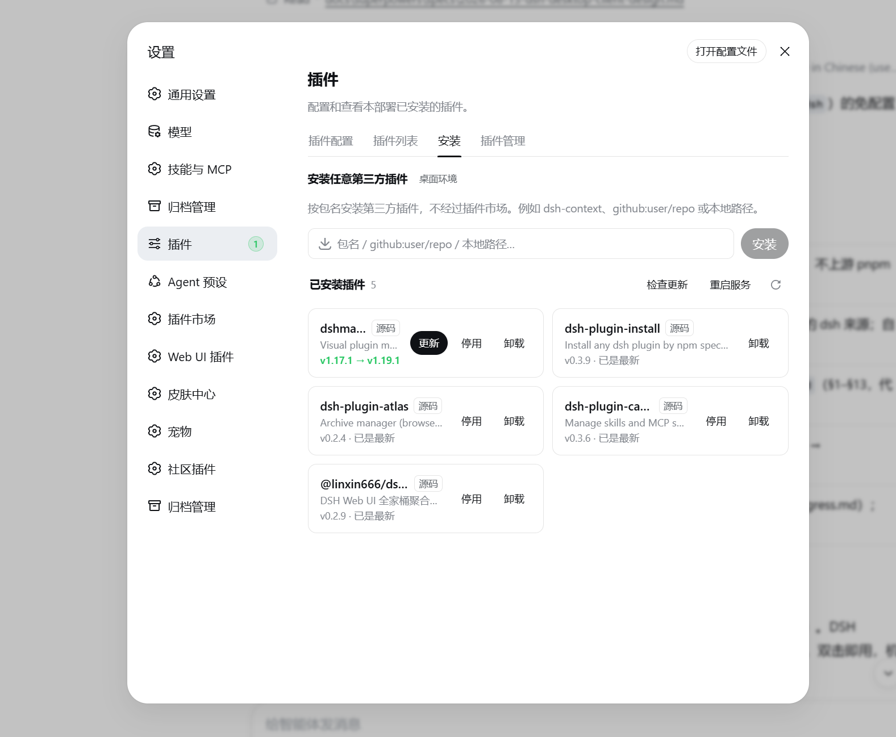
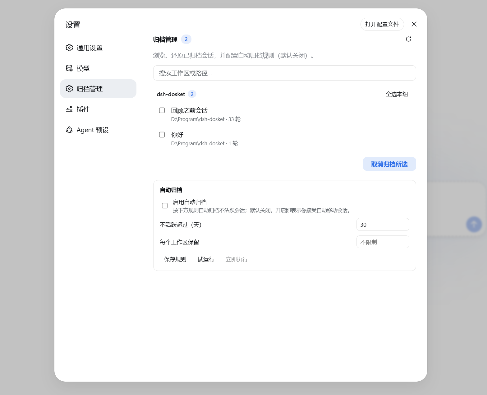
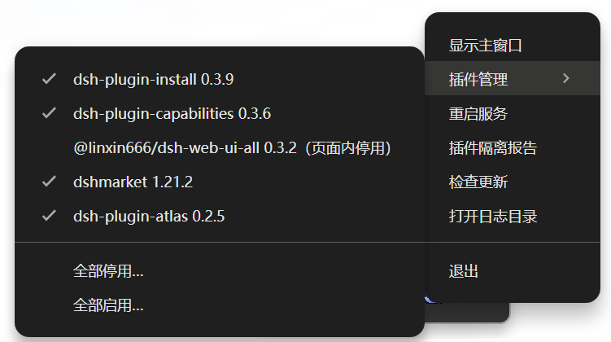

[中文](README.md) · English

<div align="center">

# DSH Desktop

**Zero-config desktop client for [DeepSeek Harness](https://github.com/deepseek-ai/deepseek-harness) (dsh)**

Install and run. No Node.js, pnpm, or terminal required.


[](https://github.com/qinyre/dsh-Desktop/actions/workflows/ci.yml)
[](LICENSE)

[](https://www.electronjs.org/)
[](https://github.com/qinyre/dsh-Desktop/releases)
[](https://www.npmjs.com/package/@deepseek-ai/dsh)

</div>

---

## Why

DeepSeek Harness ships a first-class Web UI, but it assumes a developer workstation: install Node, install dsh, keep a terminal open, remember the port. **DSH Desktop wraps the exact same Web UI in a native app** — bundling its own Node runtime and dsh, so the agent harness is available to everyone else with a double click.

## Highlights

- The installer bundles the whole runtime — Node, a pnpm shim, and dsh. Nothing to preinstall.
- The Web UI runs unmodified: workspaces, sessions, approvals, models, skills, and terminals all work inside the app window, because DSH Desktop is just the shell around `dsh web`.
- The sidecar is supervised and restarted with exponential backoff, and dsh's append-only session log means a killed process doesn't lose your conversation.
- Approvals and finished turns raise native Windows notifications when the window is hidden or unfocused, and the window can be closed to the tray while long runs continue in the background.
- Four plugins come preinstalled on first launch: the visual plugin market ([dshmarket](https://github.com/dsh-market/dsh-market)), an install-anything "Install" tab ([dsh-plugin-install](https://github.com/qinyre/dsh-plugin-install)), a "Skills & MCP" settings section ([dsh-plugin-capabilities](https://github.com/qinyre/dsh-plugin-capabilities)), and session archiving plus a conversation tick rail ([dsh-plugin-atlas](https://github.com/qinyre/dsh-plugin-atlas)) — details in [Plugins](#plugins).
- Built-in plugin guard: four problem classes — conflicts, missing dependencies, plugin errors, and corrupt configuration — are detected before and after launch, both in the service and in the in-page plugin tree; the offending plugin is quarantined so the app still opens, with a dialog naming the plugin and the cause. Safe mode kicks in when no cause can be found, and plugin health keeps being monitored after launch — see [Plugin guard](#plugin-guard).
- Plugins can be managed straight from the tray: when a plugin failure keeps the page from loading at all, the in-app plugin manager goes down with it — the tray's "Plugins" section needs neither the service nor the page to list every plugin's state, disable or re-enable them individually, enter safe mode manually, or restore packages the guard removed from the launch list.
- The native title bar follows the Web UI's light/dark theme (exact match on Windows 11, dark/light on Windows 10).
- Updates ask before installing and back up your sessions, credentials, and settings beforehand.

## Install

Download the latest `DSH-Desktop-Setup-x.x.x.exe` from the [Releases](https://github.com/qinyre/dsh-Desktop/releases) page and run it.

Requirements: Windows 10/11 x64. Installs per-user; no administrator rights required.

> The installer is not code-signed (the cheapest certificate an individual can buy is around €105/year — skipped for now), so Windows SmartScreen may block the first run; choose "More info" → "Run anyway". To sign your own builds, see [docs/signing.md](docs/signing.md).

Linux (x64) ships two packages. The `DSH-Desktop-x.x.x.AppImage` runs directly after `chmod +x`, and later versions download and install themselves through the in-app update check; the `DSH-Desktop-x.x.x.deb` installs through your package manager and is upgraded by downloading a newer deb manually (the in-app update check stays disabled under deb installs, so it never claims a false "up to date"). The AppImage uses a statically linked runtime, so it doesn't depend on the system FUSE library. On distributions that restrict unprivileged user namespaces (Ubuntu 24.04 and friends) the app automatically runs without the Chromium sandbox — expected behavior in the AppImage ecosystem; prefer the deb if you want the sandbox (its install script configures the matching AppArmor allowance).

The tray icon and desktop notifications rely on services that mainstream desktop environments provide. When no tray host exists, closing the window quits the app — it never hides the window into a tray that isn't there.

### First run

The app starts the sidecar and opens the dsh Web UI. Onboarding is identical to the browser version: set your API key in **Settings → Models** and choose a workspace directory.

## Plugins

DSH Desktop keeps all three of dsh's plugin capability layers:

| Layer | How |
|---|---|
| Per-session dynamic mounting | Choose the `cordis` agent preset in the Web UI — the agent writes and mounts plugins at runtime, no restart |
| Plugin inventory & config | Settings → Plugins, as in the Web UI |
| Third-party plugin packages | The plugin market ([dshmarket](https://github.com/dsh-market/dsh-market)) or the "Install" tab (direct install by npm spec), both inside the settings page |

On first launch DSH Desktop preinstalls the four plugins below into the app's own profile. Client-only plugins activate after a page refresh; changes that need a restart show a pending notice — restart from the tray menu or the "Install" tab.

### Plugin market · [dshmarket](https://github.com/dsh-market/dsh-market)

A visual market inside the Web UI's settings page, covering the curated [awesome-dsh-plugin](https://awesome-dsh-plugin.com) directory: browse, search, one-click install/uninstall, and per-plugin updates all happen on the page, and the market updates itself through the same channel.

### Install anything · [dsh-plugin-install](https://github.com/qinyre/dsh-plugin-install)

Contributes an "Install" tab that skips the market: type a package name (npm spec, `github:user/repo`, or a local path) and any dsh plugin installs directly. The installed list doubles as an updater — npm installs compare against the registry's latest version, github installs against new upstream commits — with in-place upgrades; the tab's restart-service button hands the restart to the app shell.



### Skills & MCP · [dsh-plugin-capabilities](https://github.com/qinyre/dsh-plugin-capabilities)

Adds a "Skills & MCP" section to the settings page, level with Models and Plugins: create, edit, and delete skills in the catalog; manage MCP servers (stdio commands or http URLs) the same way; pull in skills plus MCP config from Claude Code or Codex — whichever of those agents exists on the machine shows up as a source. Every skill can be toggled on or off individually, local folders or GitHub repos can be registered as extra skill sources, and the section's own skill and MCP markets install curated entries with one click. The catalog ships with two read-only starter skills, skill-creator and find-skills.


### Archive & tick rail · [dsh-plugin-atlas](https://github.com/qinyre/dsh-plugin-atlas)

An "Archive management" section in Settings — browse, preview, and restore archived sessions there, with auto-archive rules as an option — plus a tick rail along the conversation's left edge where every turn is a dash: hover to preview, click to jump.




> Installing a plugin executes third-party code on your machine (pnpm lifecycle scripts) — same as the dsh CLI. Only install plugins you trust.

## Plugin guard

dsh activates its plugin tree as a whole: a single plugin that fails to import, conflicts with another (for example, two plugins registering the same entry id, or the same plugin composed twice), or lacks a dependency prevents the entire service from starting. DSH Desktop therefore performs a static check before launch — including verification of plugin package integrity, so plugins left incomplete by an interrupted install are disabled in advance — and, if the service still fails to boot, locates the specific plugin from the crash log, disables it, and restarts automatically. In most cases the only noticeable effect is a slightly slower startup: the app opens as usual and a dialog identifies the quarantined plugin and the reason.

One class of trouble only shows up inside the page. The web UI runs a plugin tree of its own, so when two plugins claim the same resource — say, the same locale namespace — the service stays perfectly healthy while the page sits stuck on the plugin loading screen. The guard watches that side as well: a boot failure reported by the page pinpoints the offending plugin, which is disabled before the page reloads and retries; when retries run out or nothing can be pinned down, a dialog takes over instead. The same failure surfacing mid-session is only reported, never refreshing a page you are using.

Some crashes leave no diagnostic trace — for example, a plugin terminating the process through native code, or hanging during startup without any output. After two consecutive failures of this kind, DSH Desktop enters a safe mode: all installed plugins are disabled and only the bundled base remains, so the client can still start, with the reason stated in the dialog. If startup fails even in safe mode, the report states plainly that the problem most likely lies outside plugins. Quarantine records remain available in the tray menu's plugin report and can be re-enabled with one click once a plugin is believed to be fixed; a plugin that is still broken is simply quarantined again and never locks up the app.

Everything above assumes the in-app interface is eventually reachable — yet the plugin page itself is a plugin, and when the failure is bad enough that the page never loads, it is of no help. The tray menu therefore carries an independent "Plugins" section that works without the service and without any page: it lists all installed plugins with their enabled state (noting whether each was disabled by the guard, from the in-app page, or by hand), disables or re-enables them one by one, enters safe mode on demand, and brings everything back in one click. Every change is followed by an automatic service restart so it takes effect deterministically; rapid consecutive actions merge into one restart. Damaged packages the guard removed from the launch list appear here too and can be readmitted after a confirmation, with a restart to verify — if they really are broken, the guard removes them again.



The guard remains active after launch: plugin health is checked periodically, plugins that fail at runtime are disabled and recorded immediately, and plugins left waiting indefinitely for a service that never arrives are also recorded, to appear in the next quarantine report. A plugin that fails to mount while the service keeps running — the failure lands only in the log — is caught by a periodic log patrol and announced with a tray notification.

## Troubleshooting & feedback

Most launch failures recover on their own (see [Plugin guard](#plugin-guard) above): quarantined plugins can be re-enabled with one click from the tray's plugin report, and when the page won't open at all, the tray's "Plugins" section still works.

If it stays broken: quit completely from the tray icon and start again; check the log at `%APPDATA%\DSH Desktop\logs\sidecar.log` (on Linux: `~/.config/DSH Desktop/logs/sidecar.log`) — plugin and startup problems all land there (with a few rotated older copies); reinstalling the app does not touch your data (next section).

Please report problems via [GitHub Issues](https://github.com/qinyre/dsh-Desktop/issues), attaching that log plus your Windows version and installer version. For security issues, use the channels in [SECURITY.md](SECURITY.md) instead of a public issue.

## Your data

All user data lives in one place: `%APPDATA%\DSH Desktop\dsh-home` (on Linux: `~/.config/DSH Desktop/dsh-home`) — sessions (append-only logs, so a crashed process loses nothing already saved), API keys and credentials, settings, and the plugins installed into the app's own profile. Copying the directory is a complete manual backup; when migrating to another machine, sessions and credentials work as-is, and the odd plugin may need a reinstall.

- Before installing an update, the app automatically backs the whole directory up to `%APPDATA%\DSH Desktop\backups`, keeping the most recent copy.
- Uninstalling does not delete this data; remove the `%APPDATA%\DSH Desktop` folder to erase everything.

## How it works

DSH Desktop is an Electron shell. On launch it reuses the Electron binary as a Node runtime (`ELECTRON_RUN_AS_NODE`) to spawn `dsh web --no-open --port 0 --host 127.0.0.1` as a child process, reads the actual port from the readiness line on stdout, and points the window at `http://127.0.0.1:<port>`. The app carries a single runtime (no Node version drift), and the server binds a random loopback port only, never exposed to the network. A pnpm shim is generated under userData and prepended to the sidecar's PATH, so the dsh CLI and the market's install subprocesses find pnpm even on machines without any Node.

The local HTTP API has no authentication — that is upstream's design, and the Origin fence guards against DNS rebinding, not local processes. Any process running as your user can talk to it, but such a process could just as well read dsh's on-disk credentials directly, so the added exposure only matters once the machine is already compromised. See the upstream [connection docs](https://github.com/deepseek-ai/deepseek-harness) for the fence's exact scope.

## Development

Prerequisites: Node.js ≥ 22.19 (or ≥ 24), pnpm (`corepack enable`; the version is pinned via packageManager). For the integration smokes you also need a sibling checkout of the upstream repo:

```bash
git clone https://github.com/qinyre/dsh-Desktop.git
cd dsh-Desktop
git clone https://github.com/deepseek-ai/deepseek-harness.git   # dev-mode sidecar source
cd deepseek-harness && pnpm install && pnpm run build && cd ..
cd desktop && pnpm install
```

```bash
pnpm run dev            # launch the app (dev uses the source checkout)
pnpm test               # unit tests
pnpm run smoke:sidecar  # boots a real dsh sidecar, asserts readiness + /api
pnpm run smoke:guard    # plugin-guard full-chain smoke: mock plugins inject conflicts, missing deps, and crashes; asserts auto-quarantine then a clean boot
pnpm run smoke:tray     # tray plugin manager smoke: disables/enables plugins against a live sidecar, asserts live application and restore round-trip
DSH_DESKTOP_PLUGIN_SMOKE=1 pnpm run smoke:market   # clean-PATH market seed smoke
pnpm run smoke:picker   # workspace-picker koffi patch smoke (Windows)
pnpm run smoke:hideconsole  # subprocess windowsHide patch smoke (Windows)
pnpm run check:electron # asserts Electron's embedded Node satisfies dsh's engines
pnpm run dist           # build the NSIS installer
pnpm run dist:linux     # build the Linux AppImage + deb (must run on Linux/WSL)
pnpm run verify:bundle  # packaged-app self-check: dependency closure + real boot from an isolated copy (run before every release)
pnpm run dist:signed    # build + sign + verify the installer (credential env vars: docs/signing.md)
```

Dev mode resolves the upstream checkout at `../deepseek-harness` (override with `DESKTOP_DSH_REPO`); `DESKTOP_DSH_MODE=npm` switches to the bundled registry package. Smokes self-skip when their prerequisites are absent.

To ship a Linux release, run `pnpm run dist:linux` on WSL/Linux and upload four files to the same GitHub Release manually: `DSH-Desktop-x.x.x.AppImage`, `DSH-Desktop-x.x.x.AppImage.blockmap`, `DSH-Desktop-x.x.x.deb`, and `latest-linux.yml`. The AppImage's in-app updater depends on the latter two (differential downloads) — skipping them cuts off Linux auto-updates. Keep asset filenames byte-identical to the urls inside latest-linux.yml; don't rename on upload.

### Known patches

The five patch files under `patches/` implement three fixes, declared as pnpm patchedDependencies and applied automatically by `pnpm install`; a dsh upgrade that breaks any of them fails loudly at install time instead of silently regressing. Full background and rationale: [docs/patches.md](docs/patches.md).

- **Brick-proof boot (dsh-app-boot)**: a missing plugin package (debris of an interrupted update) no longer rejects the whole loader tree; the bundle is skipped with a warning.
- **Workspace picker (koffi)**: fixes the worker crash after picking a workspace folder in packaged builds; verified by `pnpm run smoke:picker`.
- **Console windows (windowsHide / SW_HIDE)**: a GUI process has no console to inherit, so dsh's subprocess calls and the sandbox runner used to flash a black console window on every invocation; fixed on two layers, verified by `pnpm run smoke:hideconsole`.

### Project layout

```text
desktop/
├── src/main/sidecar/     # process supervision: state machine, runtime resolver, logs
├── src/main/windows/     # window controller, navigation guard, status page
├── src/main/events/      # EventTap: two downlink WebSockets → notifications
├── src/main/plugins/     # plugin seeding + plugin guard (detect / quarantine / report) + runtime pnpm shim
├── src/main/tray/        # tray controller
├── src/main/updater/     # electron-updater + DSH_HOME backup
└── src/renderer/         # status page (the rest is dsh's Web UI)
```

## Roadmap

- [x] First public release + update feed (v0.1.0 shipped; startup checks GitHub Releases, asks before installing with a backup)
- [x] Linux builds (AppImage + deb, starting with v0.1.16; Linux CI and packaged-app self-check included)
- [ ] macOS build
- [ ] Route B: `file://` + IPC bridge (drops the local HTTP surface entirely)

## Acknowledgments

- [DeepSeek AI](https://github.com/deepseek-ai) for [deepseek-harness](https://github.com/deepseek-ai/deepseek-harness) — DSH Desktop is a thin shell around their work.
- [Electron](https://www.electronjs.org/), [electron-vite](https://electron-vite.org/), [electron-builder](https://www.electron.build/), [pnpm](https://pnpm.io/).

## License

[MIT](LICENSE) © 2026 qinyre

DSH Desktop bundles [@deepseek-ai/dsh](https://www.npmjs.com/package/@deepseek-ai/dsh) (MIT) and its dependencies; DeepSeek Harness is a project of DeepSeek AI, unaffiliated with this client.
