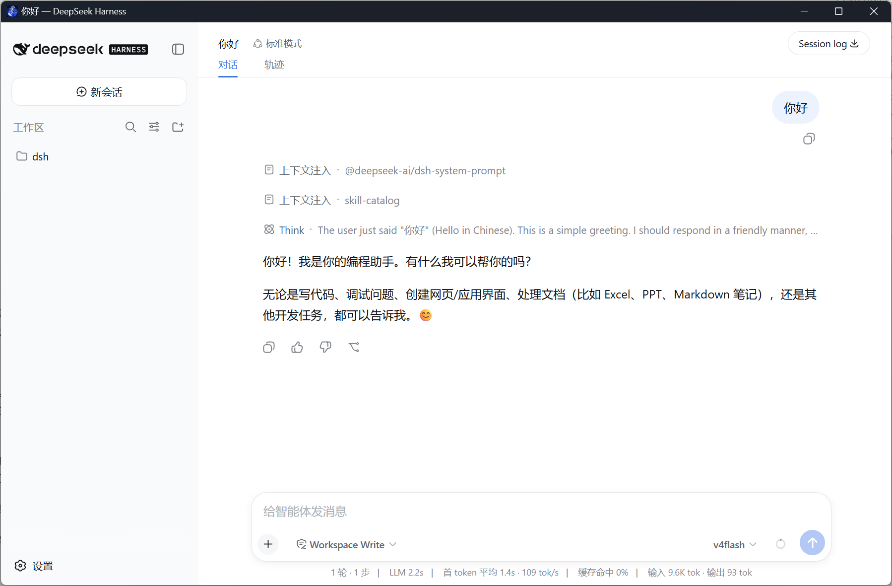

<div align="center">

# DSH Desktop

**Zero-config desktop client for [DeepSeek Harness](https://github.com/deepseek-ai/deepseek-harness) (dsh)**

Install it, double-click it, chat. No Node.js, no pnpm, no terminal.

<!-- TODO: replace with a real screenshot of the main window -->


[](https://github.com/qinyre/dsh-Desktop/actions/workflows/ci.yml)
[](LICENSE)

[](https://www.electronjs.org/)
[](https://www.npmjs.com/package/@deepseek-ai/dsh)

</div>

---

## Why

DeepSeek Harness ships a first-class Web UI, but it assumes a developer workstation: install Node, install dsh, keep a terminal open, remember the port. **DSH Desktop wraps the exact same Web UI in a native app** — bundling its own Node runtime and dsh, so the agent harness is a double-click away for everyone else.

## Highlights

- **True zero-config** — the installer bundles everything. A machine with nothing but Windows runs the full dsh Web UI after one setup click.
- **The real Web UI, unmodified** — every feature of `dsh web` (workspaces, sessions, approvals, models, skills, plan mode, terminals) runs inside the app window. DSH Desktop is a shell, not a reimplementation.
- **Crash-resilient** — the sidecar is supervised with exponential-backoff restarts; dsh's append-only session log means a killed process never loses your conversation.
- **Native notifications** — approvals waiting and turns finishing surface as Windows toasts when the window is hidden or unfocused. Close-to-tray keeps long agent runs out of your way.
- **Built-in plugin manager** — install third-party dsh plugins from the tray menu. The app ships its own pnpm shim, so installing plugins needs no Node/pnpm on PATH.
- **Auto-update with data backup** — updates ask before installing and back up your sessions, credentials, and settings first.

## Install

Grab the latest `DSH Desktop Setup x.x.x.exe` from [**Releases**](https://github.com/qinyre/dsh-Desktop/releases) and run it.

<!-- TODO: add a Releases download badge/link once the first release is published -->

Requirements: Windows 10/11 (x64). That's the list.

### First run

The app starts the sidecar and opens the dsh Web UI. Configure your API key in **Settings → Models** (same onboarding as the Web UI), pick a workspace, and start chatting.

## Plugins

DSH Desktop keeps all three of dsh's plugin capability layers:

| Layer | How |
|---|---|
| Per-session dynamic mounting | Choose the `cordis` agent preset in the Web UI — the agent writes and mounts plugins at runtime, no restart |
| Plugin inventory & config | Settings → Plugins, as in the Web UI |
| Third-party plugin packages | **Tray → 插件管理…** (Plugin Manager) |

The plugin manager installs into the app's own profile, e.g.:

```text
@linxin666/dsh-web-ui-all
```

then click **重启生效** (restart to apply). Removing a plugin works the same way. Install output streams into the dialog, including pnpm's `allowBuilds` guidance for git-hosted plugins.

> Installing a plugin executes third-party code on your machine (pnpm lifecycle scripts) — same as the dsh CLI. Only install plugins you trust.

## How it works

```text
┌─ DSH Desktop (Electron) ─────────────────┐
│  supervisor · window · tray · notifier    │
└────────────┬──────────────────────────────┘
             │ spawn (ELECTRON_RUN_AS_NODE)
             ▼
   dsh web --port 0 --host 127.0.0.1
             │ stdout readiness line
             ▼
   window loads http://127.0.0.1:<random port>
```

- The sidecar reuses the Electron binary as its Node runtime — one runtime, no version drift.
- The server binds a **random loopback port only**; it is never exposed to the network.
- **Threat model, stated plainly:** the local HTTP API has no authentication (an upstream design point — it is a DNS-rebinding fence, not an auth layer). Any process running as your user could talk to it — but such a process could equally read dsh's on-disk credentials directly, so the marginal exposure is limited to "the machine is already compromised." See the upstream [connection docs](https://github.com/deepseek-ai/deepseek-harness) for the fence's exact scope.

## Development

Prerequisites: Node.js ≥ 22.19 (or ≥ 24), npm. For the integration smokes you also need a sibling checkout of the upstream repo:

```bash
git clone https://github.com/qinyre/dsh-Desktop.git
cd dsh-Desktop
git clone https://github.com/deepseek-ai/deepseek-harness.git   # dev-mode sidecar source
cd deepseek-harness && pnpm install && pnpm run build && cd ..
cd desktop && npm install
```

```bash
npm run dev            # launch the app (dev uses the source checkout)
npm test               # unit tests
npm run smoke:sidecar  # boots a real dsh sidecar, asserts readiness + /api
DSH_DESKTOP_PLUGIN_SMOKE=1 npm run smoke:plugin   # clean-PATH plugin install (Windows)
npm run check:electron # asserts Electron's embedded Node satisfies dsh's engines
npm run dist           # build the NSIS installer
```

Dev mode resolves the upstream checkout at `../deepseek-harness` (override with `DESKTOP_DSH_REPO`); `DESKTOP_DSH_MODE=npm` switches to the bundled registry package. Smokes self-skip when their prerequisites are absent.

### Project layout

```text
desktop/
├── src/main/sidecar/     # process supervision: state machine, runtime resolver, logs
├── src/main/windows/     # window controller, navigation guard, status page
├── src/main/events/      # EventTap: two downlink WebSockets → notifications
├── src/main/plugins/     # plugin manager + runtime pnpm shim
├── src/main/tray/        # tray controller
├── src/main/updater/     # electron-updater + DSH_HOME backup
└── src/renderer/         # status page + plugin dialog (the rest is dsh's Web UI)
```

## Roadmap

- [ ] First public release (icon, signed installer, update feed)
- [ ] macOS and Linux builds
- [ ] Route B: `file://` + IPC bridge (drops the local HTTP surface entirely)

## Acknowledgments

- [DeepSeek AI](https://github.com/deepseek-ai) for [deepseek-harness](https://github.com/deepseek-ai/deepseek-harness) — DSH Desktop is a thin shell around their work.
- [Electron](https://www.electronjs.org/), [electron-vite](https://electron-vite.org/), [electron-builder](https://www.electron.build/), [pnpm](https://pnpm.io/).

## License

[MIT](LICENSE) © 2026 qinyre

DSH Desktop bundles [@deepseek-ai/dsh](https://www.npmjs.com/package/@deepseek-ai/dsh) (MIT) and its dependencies; DeepSeek Harness is a project of DeepSeek AI, unaffiliated with this client.
